# Planejamento — Number Guessing Game em Java

## 1. Visão Geral do Desafio

### 1.1 Intenção do desafio
O objetivo deste desafio é construir um jogo de adivinhação de números via linha de comando (CLI), aplicando boas práticas de engenharia de software em Java: Programação Orientada a Objetos (POO), princípios **SOLID**, **arquitetura em camadas**, testes automatizados e gerenciamento de dependências com **Maven**.

Mais do que "fazer o jogo funcionar", a proposta é usar um problema simples como pretexto para exercitar:

- Separação de responsabilidades entre camadas (apresentação, aplicação/serviço, domínio e infraestrutura);
- Modelagem de domínio orientada a objetos (não é só um `switch` gigante em `main`);
- Testabilidade (o núcleo de regras do jogo deve ser testável sem depender de `System.in`/`System.out`);
- Extensibilidade (features extras — rodadas múltiplas, timer, dicas, high score — devem se encaixar na arquitetura sem reescrever tudo).

### 1.2 Como o jogo deve funcionar (fluxo esperado)
1. O sistema exibe mensagem de boas-vindas e as regras do jogo.
2. O usuário escolhe a dificuldade (Fácil / Médio / Difícil), que define o número de tentativas.
3. O sistema sorteia um número aleatório entre 1 e 100.
4. O usuário insere tentativas até acertar ou esgotar as chances.
5. A cada tentativa incorreta, o sistema informa se o número secreto é maior ou menor.
6. Ao acertar, exibe mensagem de vitória com número de tentativas e tempo gasto.
7. Ao esgotar as chances, exibe mensagem de derrota revelando o número.
8. O sistema pergunta se o usuário deseja jogar novamente.
9. Ao final de cada rodada, atualiza e exibe o **recorde (high score)** por nível de dificuldade.

---

## 2. Levantamento de Requisitos

### 2.1 Requisitos Funcionais (RF)

| ID | Descrição |
|----|-----------|
| RF01 | O sistema deve exibir uma mensagem de boas-vindas e as regras do jogo ao iniciar. |
| RF02 | O sistema deve permitir a escolha entre 3 níveis de dificuldade: Fácil (10 chances), Médio (5 chances) e Difícil (3 chances). |
| RF03 | O sistema deve sortear aleatoriamente um número inteiro entre 1 e 100 (inclusive). |
| RF04 | O sistema deve permitir que o usuário insira um número como tentativa de adivinhação. |
| RF05 | O sistema deve validar a entrada do usuário (número inteiro, dentro do intervalo 1–100). |
| RF06 | Ao errar, o sistema deve informar se o número secreto é **maior** ou **menor** que a tentativa. |
| RF07 | Ao acertar, o sistema deve exibir mensagem de vitória com a quantidade de tentativas utilizadas. |
| RF08 | Ao esgotar as tentativas sem acerto, o sistema deve exibir mensagem de derrota e revelar o número secreto. |
| RF09 | O sistema deve permitir jogar múltiplas rodadas, perguntando ao final de cada uma se o usuário deseja continuar. |
| RF10 | O sistema deve medir e exibir o tempo gasto (em segundos) para acertar o número. |
| RF11 | O sistema deve oferecer dicas ao usuário mediante solicitação (ex.: paridade do número, se é múltiplo de X, proximidade). |
| RF12 | O sistema deve armazenar e exibir o **high score** (menor número de tentativas) por nível de dificuldade, persistindo entre rodadas da mesma execução (e, opcionalmente, entre execuções via arquivo). |

### 2.2 Requisitos Não Funcionais (RNF)

| ID | Descrição |
|----|-----------|
| RNF01 | O sistema deve ser executável via CLI (linha de comando), sem interface gráfica. |
| RNF02 | O código deve seguir princípios de POO (encapsulamento, abstração, herança/composição, polimorfismo onde fizer sentido). |
| RNF03 | O código deve seguir os princípios **SOLID**. |
| RNF04 | O projeto deve ser estruturado em **camadas** (apresentação, aplicação, domínio, infraestrutura). |
| RNF05 | O núcleo do domínio (regras do jogo) não deve depender diretamente de `System.in`/`System.out` — deve ser testável isoladamente. |
| RNF06 | O projeto deve ter cobertura de testes automatizados (unitários e, se possível, de integração) com **JUnit 5**. |
| RNF07 | O build e o gerenciamento de dependências devem ser feitos via **Maven**. |
| RNF08 | O código deve ser legível, coeso e seguir convenções de nomenclatura Java (Google Java Style ou similar). |
| RNF09 | O sistema deve tratar entradas inválidas sem quebrar (exceções tratadas, mensagens amigáveis). |
| RNF10 | (Opcional) O sistema deve poder ser empacotado e executado via **Docker**, garantindo reprodutibilidade do ambiente. |

### 2.3 Requisitos de Melhorias (Extras do desafio)

Essas melhorias, sugeridas no enunciado original, são tratadas como requisitos funcionais adicionais (RF09 a RF12 já as incorporam), mas vale destacar isoladamente o escopo de cada uma:

| Melhoria | Descrição | Impacto na arquitetura |
|----------|-----------|--------------------------|
| **Múltiplas rodadas** | Permitir novas partidas sem reiniciar a aplicação. | Loop de controle na camada de apresentação (`GameRunner`), reaproveitando os serviços de domínio. |
| **Timer** | Cronometrar o tempo entre o início da rodada e o acerto. | Novo componente de infraestrutura/utilitário (`GameClock` ou uso de `Instant`/`Duration`) injetado no serviço da rodada. |
| **Sistema de dicas** | Fornecer pistas (par/ímpar, múltiplo de N, "está perto") sob demanda, sem revelar o número. | Nova responsabilidade no domínio: `HintService` ou método em `GuessEvaluator`, respeitando SRP (classe própria, não misturada com avaliação de tentativa). |
| **High score** | Guardar a menor quantidade de tentativas por dificuldade. | Camada de infraestrutura/repositório (`ScoreRepository`), com implementação em memória e, opcionalmente, em arquivo (persistência simples em JSON/texto). |

---

## 3. Arquitetura em Camadas

A arquitetura proposta segue um modelo de **camadas simples inspirado em Clean Architecture / Layered Architecture**, adequado ao porte do projeto (evitando over-engineering, mas demonstrando separação clara de responsabilidades).

```
com.anaclarissi.numberguessinggame
│
├── presentation/        → Camada de Apresentação (CLI)
│   ├── ConsoleView.java
│   ├── ConsoleInputReader.java
│   └── GameRunner.java          (orquestra o fluxo, ponto de entrada da UI)
│
├── application/         → Camada de Aplicação (casos de uso / serviços)
│   ├── GameService.java
│   ├── HintService.java
│   └── ScoreService.java
│
├── domain/              → Camada de Domínio (regras de negócio puras)
│   ├── model/
│   │   ├── Difficulty.java        (enum)
│   │   ├── SecretNumber.java
│   │   ├── Guess.java
│   │   ├── GuessResult.java       (enum: TOO_LOW, TOO_HIGH, CORRECT)
│   │   ├── GameRound.java
│   │   └── ScoreRecord.java
│   ├── service/
│   │   ├── NumberGeneratorPort.java   (interface)
│   │   └── GuessEvaluator.java
│   └── exception/
│       ├── InvalidGuessException.java
│       └── OutOfAttemptsException.java
│
├── infrastructure/      → Camada de Infraestrutura (implementações técnicas)
│   ├── random/
│   │   └── RandomNumberGenerator.java   (implementa NumberGeneratorPort)
│   ├── clock/
│   │   └── SystemGameClock.java
│   └── persistence/
│       ├── ScoreRepository.java         (interface)
│       ├── InMemoryScoreRepository.java
│       └── FileScoreRepository.java     (opcional, persistência em arquivo)
│
└── Main.java             → Ponto de entrada da aplicação (composição/DI manual)
```

### 3.1 Responsabilidade de cada camada

- **Presentation (Apresentação):** interage com o usuário via console. Não conhece regras de negócio, apenas chama serviços da camada de aplicação e formata saída/entrada.
- **Application (Aplicação):** orquestra os casos de uso (iniciar rodada, processar tentativa, encerrar rodada, calcular e registrar score). Coordena domínio + infraestrutura.
- **Domain (Domínio):** contém as regras puras do jogo (comparação de números, validação de tentativa, cálculo de resultado). Não depende de nenhuma outra camada — é o núcleo, 100% testável isoladamente.
- **Infrastructure (Infraestrutura):** implementações concretas de portas definidas no domínio/aplicação (geração de número aleatório, relógio do sistema, persistência do high score).

Essa separação segue a **Regra de Dependência**: as camadas externas dependem das internas (via interfaces/abstrações), nunca o contrário — o domínio não conhece `RandomNumberGenerator`, apenas a interface `NumberGeneratorPort`.

---

## 4. Diagrama de Classes

```mermaid
classDiagram
    class Difficulty {
        <<enumeration>>
        EASY
        MEDIUM
        HARD
        +getMaxAttempts() int
        +getLabel() String
    }

    class SecretNumber {
        -int value
        +getValue() int
        +isEqualTo(int guess) boolean
    }

    class Guess {
        -int value
        -int attemptNumber
        +Guess(int value, int attemptNumber)
    }

    class GuessResult {
        <<enumeration>>
        TOO_LOW
        TOO_HIGH
        CORRECT
    }

    class GameRound {
        -SecretNumber secretNumber
        -Difficulty difficulty
        -int attemptsUsed
        -boolean finished
        -Duration elapsedTime
        +registerGuess(int value) GuessResult
        +isWon() boolean
        +isOver() boolean
        +getAttemptsUsed() int
    }

    class GuessEvaluator {
        +evaluate(SecretNumber secret, Guess guess) GuessResult
    }

    class NumberGeneratorPort {
        <<interface>>
        +generate(int min, int max) int
    }

    class RandomNumberGenerator {
        +generate(int min, int max) int
    }

    class GameClockPort {
        <<interface>>
        +start() void
        +stop() Duration
    }

    class SystemGameClock {
        +start() void
        +stop() Duration
    }

    class ScoreRecord {
        -Difficulty difficulty
        -int bestAttempts
        -String playerName
    }

    class ScoreRepositoryPort {
        <<interface>>
        +save(ScoreRecord record) void
        +findBestByDifficulty(Difficulty d) ScoreRecord
    }

    class InMemoryScoreRepository {
        +save(ScoreRecord record) void
        +findBestByDifficulty(Difficulty d) ScoreRecord
    }

    class FileScoreRepository {
        +save(ScoreRecord record) void
        +findBestByDifficulty(Difficulty d) ScoreRecord
    }

    class GameService {
        -NumberGeneratorPort numberGenerator
        -GuessEvaluator evaluator
        -GameClockPort clock
        +startNewRound(Difficulty d) GameRound
        +processGuess(GameRound round, int value) GuessResult
    }

    class HintService {
        +giveHint(SecretNumber secret, Guess lastGuess) String
    }

    class ScoreService {
        -ScoreRepositoryPort repository
        +registerResult(Difficulty d, int attempts) void
        +getHighScore(Difficulty d) ScoreRecord
    }

    class ConsoleView {
        +showWelcome() void
        +showDifficultyMenu() void
        +showResult(GuessResult result) void
        +showVictory(int attempts, Duration time) void
        +showDefeat(int secretValue) void
        +showHighScore(ScoreRecord record) void
    }

    class ConsoleInputReader {
        +readDifficultyChoice() Difficulty
        +readGuess() int
        +readYesNo(String question) boolean
    }

    class GameRunner {
        -GameService gameService
        -HintService hintService
        -ScoreService scoreService
        -ConsoleView view
        -ConsoleInputReader input
        +run() void
    }

    NumberGeneratorPort <|.. RandomNumberGenerator
    GameClockPort <|.. SystemGameClock
    ScoreRepositoryPort <|.. InMemoryScoreRepository
    ScoreRepositoryPort <|.. FileScoreRepository

    GameRound "1" --> "1" SecretNumber
    GameRound "1" --> "*" Guess
    GameRound --> Difficulty
    GuessEvaluator --> GuessResult

    GameService --> NumberGeneratorPort
    GameService --> GuessEvaluator
    GameService --> GameClockPort
    GameService --> GameRound

    ScoreService --> ScoreRepositoryPort
    ScoreService --> ScoreRecord

    GameRunner --> GameService
    GameRunner --> HintService
    GameRunner --> ScoreService
    GameRunner --> ConsoleView
    GameRunner --> ConsoleInputReader
```



---

## 5. Aplicação dos Princípios SOLID

| Princípio | Como é aplicado no projeto |
|-----------|------------------------------|
| **S** — Single Responsibility | Cada classe tem uma única razão para mudar: `GuessEvaluator` só avalia tentativas, `ScoreService` só cuida de score, `ConsoleView` só formata saída, `HintService` só gera dicas. |
| **O** — Open/Closed | Novos tipos de dificuldade podem ser adicionados ao `enum Difficulty` sem alterar o `GameService`. Novas formas de persistência de score (arquivo, banco) são adicionadas implementando `ScoreRepositoryPort`, sem tocar em `ScoreService`. |
| **L** — Liskov Substitution | Qualquer implementação de `NumberGeneratorPort`, `GameClockPort` ou `ScoreRepositoryPort` pode substituir outra sem quebrar o comportamento esperado pelas classes que as consomem (ex.: `InMemoryScoreRepository` ↔ `FileScoreRepository`). |
| **I** — Interface Segregation | As interfaces (`NumberGeneratorPort`, `GameClockPort`, `ScoreRepositoryPort`) são pequenas e específicas, evitando métodos não usados pelos implementadores. |
| **D** — Dependency Inversion | `GameService` e `ScoreService` dependem de abstrações (`*Port`), não de implementações concretas. A composição das dependências concretas acontece em `Main.java` (injeção manual), mantendo o domínio desacoplado de infraestrutura. |

### 5.1 Padrões de projeto complementares
- **Strategy:** `NumberGeneratorPort` e `ScoreRepositoryPort` permitem trocar a estratégia de geração/persistência sem alterar quem os consome.
- **Factory (simples):** um `DifficultyFactory` ou método estático no `enum Difficulty` pode centralizar a criação/validação da dificuldade escolhida.
- **Builder (opcional):** para montar `GameRound` com parâmetros opcionais (ex.: seed fixa para testes).

---

## 6. Estrutura do Projeto Maven

```
number-guessing-game/
├── pom.xml
├── README.md
├── src/
│   ├── main/
│   │   ├── java/com/anaclarissi/numberguessinggame/
│   │   │   ├── Main.java
│   │   │   ├── presentation/...
│   │   │   ├── application/...
│   │   │   ├── domain/...
│   │   │   └── infrastructure/...
│   │   └── resources/
│   │       └── application.properties   (mensagens configuráveis, opcional)
│   └── test/
│       └── java/com/anaclarissi/numberguessinggame/
│           ├── domain/
│           │   ├── GuessEvaluatorTest.java
│           │   └── GameRoundTest.java
│           ├── application/
│           │   ├── GameServiceTest.java
│           │   ├── ScoreServiceTest.java
│           │   └── HintServiceTest.java
│           └── infrastructure/
│               ├── InMemoryScoreRepositoryTest.java
│               └── RandomNumberGeneratorTest.java
└── Dockerfile   (opcional)
```

---

## 7. Tecnologias e Dependências

### 7.1 Tecnologias principais
- **Java 17** (LTS) — recursos modernos (records, switch expressions, pattern matching), compatível com boas práticas atuais.
- **Maven** — build e gerenciamento de dependências.
- **JUnit 5 (Jupiter)** — testes unitários.
- **Mockito** — mocks para testar `application` isolando `infrastructure` (ex.: simular `NumberGeneratorPort` com número fixo).
- **AssertJ** (opcional, mas recomendado) — asserções fluentes, deixando os testes mais legíveis.
- **JaCoCo** (opcional) — plugin Maven para relatório de cobertura de testes.

### 7.2 Exemplo de dependências no `pom.xml`

```xml
<dependencies>
    <!-- Testes -->
    <dependency>
        <groupId>org.junit.jupiter</groupId>
        <artifactId>junit-jupiter</artifactId>
        <version>5.10.2</version>
        <scope>test</scope>
    </dependency>

    <dependency>
        <groupId>org.mockito</groupId>
        <artifactId>mockito-core</artifactId>
        <version>5.11.0</version>
        <scope>test</scope>
    </dependency>

    <dependency>
        <groupId>org.mockito</groupId>
        <artifactId>mockito-junit-jupiter</artifactId>
        <version>5.11.0</version>
        <scope>test</scope>
    </dependency>

    <dependency>
        <groupId>org.assertj</groupId>
        <artifactId>assertj-core</artifactId>
        <version>3.25.3</version>
        <scope>test</scope>
    </dependency>
</dependencies>
```

### 7.3 Plugins Maven relevantes
- `maven-compiler-plugin` — fixar `source`/`target` em 17.
- `maven-surefire-plugin` — execução dos testes no `mvn test`.
- `maven-shade-plugin` ou `maven-assembly-plugin` — gerar um `.jar` executável (fat jar) com `Main-Class` definida, facilitando `java -jar` e uso em Docker.
- `jacoco-maven-plugin` (opcional) — relatório de cobertura.

---

## 8. Uso de Docker

**Docker não é estritamente necessário** para este desafio, já que se trata de uma aplicação CLI simples e local. No entanto, é uma boa prática incluí-lo como diferencial, garantindo reprodutibilidade do ambiente de execução (mesma versão de JDK, isolamento de dependências do host).

### 8.1 Proposta de uso
- Buildar um fat jar via `maven-shade-plugin`.
- Criar uma imagem Docker baseada em `eclipse-temurin:17-jre-alpine` (imagem leve, apenas JRE).
- Rodar o jogo interativamente via `docker run -it`.

### 8.2 Exemplo de `Dockerfile`

```dockerfile
# Etapa de build
FROM maven:3.9-eclipse-temurin-17 AS build
WORKDIR /app
COPY pom.xml .
COPY src ./src
RUN mvn clean package -DskipTests

# Etapa de execução
FROM eclipse-temurin:17-jre-alpine
WORKDIR /app
COPY --from=build /app/target/number-guessing-game.jar app.jar
ENTRYPOINT ["java", "-jar", "app.jar"]
```

Execução:
```bash
docker build -t number-guessing-game .
docker run -it --rm number-guessing-game
```

> **Observação:** como o jogo depende de entrada interativa via teclado (`stdin`), a flag `-it` é obrigatória ao rodar o container.

---

## 9. Estratégia de Testes Automatizados

### 9.1 Testes unitários (foco principal)
- **Domínio (`domain`)** — testado de forma pura, sem mocks, cobrindo:
  - `GuessEvaluator`: retorno correto de `TOO_LOW`, `TOO_HIGH`, `CORRECT`.
  - `GameRound`: transições de estado (tentativas restantes, fim de jogo por vitória ou esgotamento).
  - `Difficulty`: número de tentativas correto por nível.
- **Aplicação (`application`)** — testada com **mocks** das portas de infraestrutura (Mockito), cobrindo:
  - `GameService`: fluxo completo de uma rodada com `NumberGeneratorPort` mockado (número fixo conhecido).
  - `ScoreService`: atualização do high score apenas quando o novo resultado é melhor que o anterior.
  - `HintService`: geração de dicas coerentes para diferentes cenários.
- **Infraestrutura (`infrastructure`)**:
  - `InMemoryScoreRepository`: persistência e recuperação corretas em memória.
  - `RandomNumberGenerator`: número gerado sempre dentro do intervalo (teste estatístico simples com múltiplas execuções).

### 9.2 Testes de integração (opcional, complementar)
- Simulação do fluxo completo `GameRunner` com `ConsoleInputReader`/`ConsoleView` substituídos por *fakes* que leem de um `InputStream` simulado (ex.: `ByteArrayInputStream`) e capturam a saída (`ByteArrayOutputStream`), validando o comportamento ponta a ponta sem precisar de interação manual real.

### 9.3 Boas práticas de teste
- Padrão **AAA** (Arrange, Act, Assert) em todos os testes.
- Nomenclatura descritiva: `deveRetornarTooLowQuandoTentativaMenorQueSecreto()` ou `shouldReturnTooLow_whenGuessIsLowerThanSecret()`.
- Uso de `@ParameterizedTest` do JUnit 5 para cobrir múltiplos cenários de dificuldade/tentativas com menos duplicação.
- Cobertura mínima sugerida: **domínio ≥ 90%**, **aplicação ≥ 80%**.

---

## 10. Roadmap de Implementação (etapas sugeridas)

1. **Setup do projeto:** criar projeto Maven, configurar `pom.xml`, estrutura de pacotes e Java 17.
2. **Domínio core:** implementar `Difficulty`, `SecretNumber`, `Guess`, `GuessResult`, `GuessEvaluator`, `GameRound` + testes unitários.
3. **Portas e infraestrutura básica:** `NumberGeneratorPort` + `RandomNumberGenerator` + testes.
4. **Camada de aplicação:** `GameService` orquestrando domínio + geração de número, com testes usando mocks.
5. **Camada de apresentação (MVP):** `ConsoleView`, `ConsoleInputReader`, `GameRunner` implementando o fluxo básico do enunciado (sem melhorias ainda).
6. **Validação do MVP:** rodar o jogo completo manualmente, comparar com o "sample output" do enunciado.
7. **Melhoria 1 — Múltiplas rodadas:** loop de repetição no `GameRunner`.
8. **Melhoria 2 — Timer:** `GameClockPort` + `SystemGameClock`, integrado ao `GameService`/`GameRound`.
9. **Melhoria 3 — Dicas:** `HintService`, integrado ao `GameRunner` como opção durante a tentativa.
10. **Melhoria 4 — High score:** `ScoreRecord`, `ScoreRepositoryPort`, `InMemoryScoreRepository` (e opcionalmente `FileScoreRepository`), `ScoreService`.
11. **Refinamento SOLID:** revisão de responsabilidades, extração de interfaces, injeção de dependência manual em `Main.java`.
12. **Testes finais e cobertura:** completar suíte de testes, revisar cobertura com JaCoCo.
13. **Dockerização (opcional):** criação do `Dockerfile` e validação da execução via container.
14. **Documentação final:** `README.md` com instruções de build/execução (`mvn clean package`, `java -jar`, `docker run`).

---

## 11. Critérios de Aceite

- [ ] O jogo segue exatamente o fluxo e as mensagens descritas no enunciado (boas-vindas, regras, seleção de dificuldade, tentativas, mensagens de maior/menor, vitória/derrota).
- [ ] O código está organizado nas 4 camadas propostas (presentation, application, domain, infrastructure).
- [ ] Nenhuma classe de `domain` depende de `System.in`/`System.out` ou de implementações concretas de infraestrutura.
- [ ] Os 5 princípios SOLID estão evidentes e justificáveis na estrutura de classes.
- [ ] Existem testes automatizados cobrindo domínio e aplicação, executáveis via `mvn test`.
- [ ] As 4 melhorias (múltiplas rodadas, timer, dicas, high score) estão implementadas e integradas ao fluxo principal.
- [ ] O projeto builda com `mvn clean package` sem erros.
- [ ] (Opcional) A imagem Docker builda e executa o jogo interativamente.

---

## 12. Resumo das Decisões Técnicas

| Decisão | Justificativa |
|---------|----------------|
| Java 17 | LTS estável, recursos modernos, ampla adoção no mercado. |
| Arquitetura em camadas | Simplicidade adequada ao porte do projeto, mantendo separação de responsabilidades sem complexidade excessiva de uma Clean Architecture completa. |
| Portas/interfaces para infraestrutura | Permite testar domínio e aplicação sem dependências externas reais (aleatoriedade, tempo, persistência). |
| JUnit 5 + Mockito + AssertJ | Combinação padrão de mercado para testes Java modernos, legíveis e expressivos. |
| Docker opcional | Não essencial para o funcionamento, mas agrega valor como diferencial de portabilidade/reprodutibilidade. |
| Injeção de dependência manual (sem framework) | Evita overhead de um framework DI (Spring) para um projeto CLI simples, mantendo o foco nos conceitos de POO/SOLID puros. |

---

*Documento de planejamento — não contém implementação de código, apenas a especificação completa da arquitetura, requisitos e estratégia de construção do desafio.*
